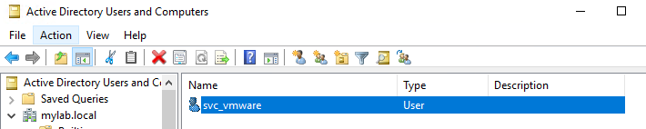
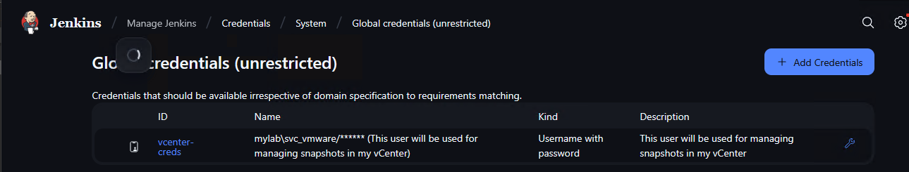

This Project is for automating the VMWare Operation using Jenkins.

Pre-requisites for setting up this workflow.
1. vcenter
2. Jenkins
3. PowerCLI

Steps to follow:
1. Login into jenkins console
2. Create a pipeline job
3. Paste the codes mentioned in Jenkins_Pipelines folder.
4. copy the vmware_automation folder on your system, and make the configuration changes for logging the vcenter.
5. create one service account and provide below permissions to perform the job in vcenter
   (Virtual Machine & Assign Virtual Machine to Resource Pool)
6. Run the jobs

Here are some Images for reference:

Service Account Created in Active Directory

Added Service Account in Jenkins for performing VMware Operations

Dashboard

Permissions required in vCenter:
Need to provide permission under Resources

Need Virtual Machine Management Permission

Need to Assign this custom created permission to service account

